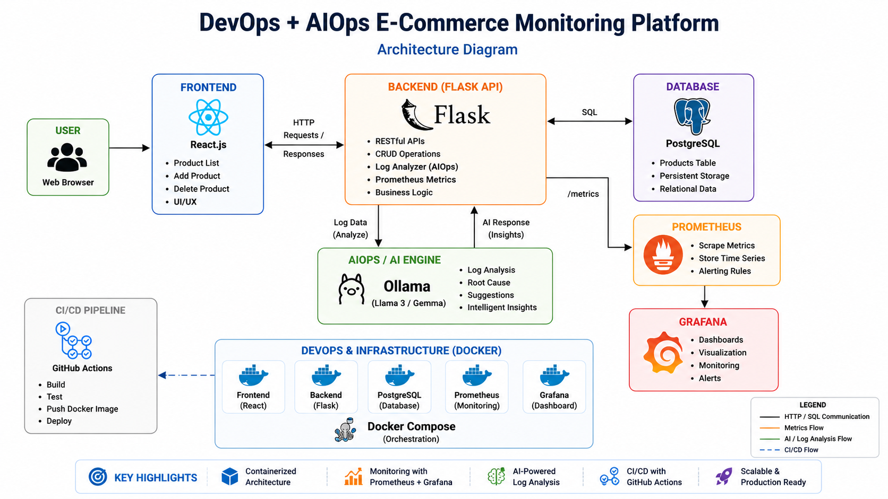
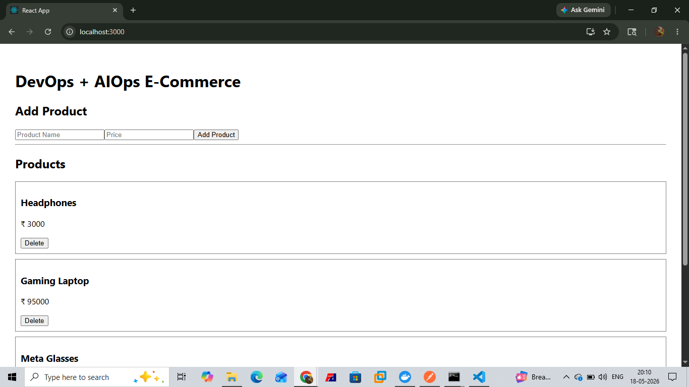
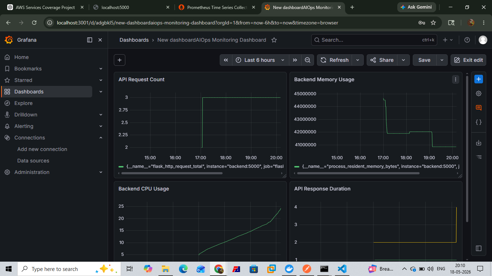
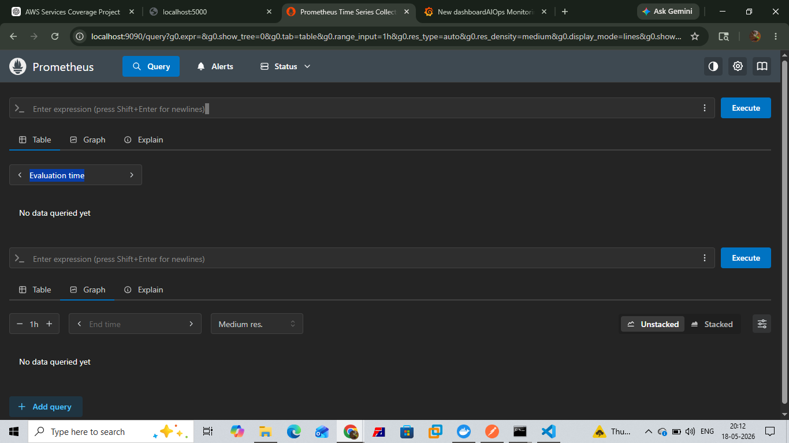
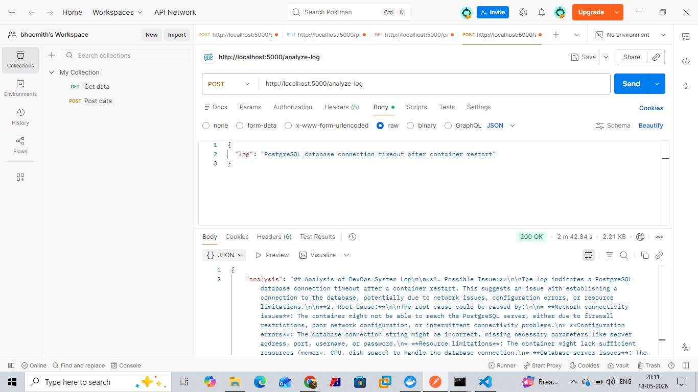

# DevOps + AIOps E-Commerce Monitoring Platform

A full-stack DevOps + AIOps based E-Commerce Monitoring Platform built using React, Flask, PostgreSQL, Docker, Prometheus, Grafana, and Ollama AI.

This project demonstrates:

- Full-stack application development
- Containerized microservices architecture
- AI-powered log analysis
- Monitoring and observability
- Docker orchestration
- CI/CD automation
- Real-time metrics visualization

---

# Features

## E-Commerce Features

- Add Products
- View Products
- Delete Products
- PostgreSQL Database Integration
- REST API Architecture

---

## DevOps Features

- Dockerized Frontend
- Dockerized Backend
- Dockerized PostgreSQL
- Docker Compose Orchestration
- Multi-container Infrastructure
- CI/CD with GitHub Actions

---

## Monitoring Features

- Prometheus Metrics Collection
- Grafana Monitoring Dashboard
- API Request Monitoring
- Backend CPU Usage Monitoring
- Backend Memory Usage Monitoring
- API Response Time Monitoring

---

## AIOps Features

- AI-powered Log Analysis
- Root Cause Detection
- Incident Analysis
- Automated Operational Insights
- Intelligent Troubleshooting Suggestions

---

# Tech Stack

## Frontend
- React.js
- Axios

## Backend
- Flask
- Flask-CORS
- psycopg2

## Database
- PostgreSQL

## Monitoring
- Prometheus
- Grafana

## AI / AIOps
- Ollama
- TinyLlama / Gemma / Llama3

## DevOps
- Docker
- Docker Compose
- GitHub Actions

---

# Architecture Diagram



---

# Project Screenshots

## Frontend UI



---

## Grafana Monitoring Dashboard



---

## Prometheus Metrics



---

## AIOps Log Analysis



---

# System Architecture

```text
User
   ↓
React Frontend
   ↓
Flask Backend API
   ↓
PostgreSQL Database

Flask Backend
   ↓
Prometheus Metrics
   ↓
Grafana Dashboard

Flask Backend
   ↓
Ollama AI Engine
   ↓
AIOps Log Analysis
